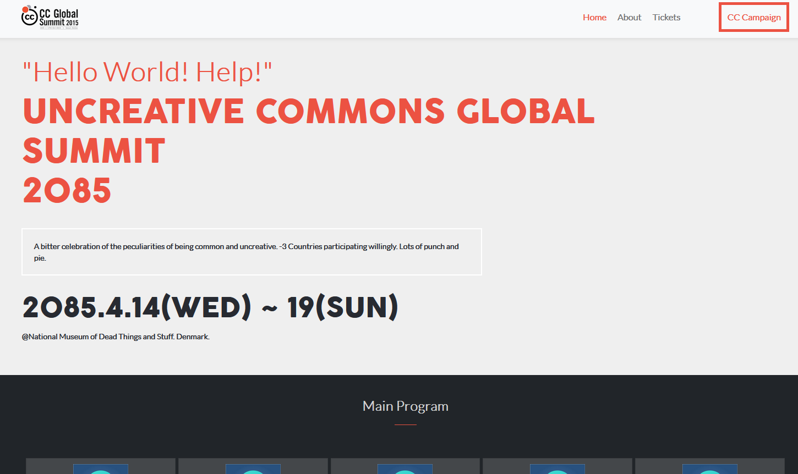

# Capstone Module 1 - Conference Website.

> The project for the fourth week in the Microverse Module 1.

# Screenshot goes here

#### A website project based on the [CC Global Summit 2015](https://www.behance.net/gallery/29845175/CC-Global-Summit-2015) model by [Cindy Shin](https://www.behance.net/adagio07).

## Built With

- HTML, CSS
- Bootstrap

## Live Demo

[Live Demo Link](https://mistermaxis.github.io/capstone-module-1/)

## Getting Started

To get a local copy up and running follow these simple example steps.

### Prerequisites

### Setup

#### Install webhint:
`npm install --save-dev hint@6.0.x`
#### Run webhint:
`npx hint .`
#### Install styleint:
`npm install --save-dev stylelint@13.3.x stylelint-scss@3.17.x stylelint-config-standard@20.0.x stylelint-csstree-validator`
#### Run styleint (with pure css):
`npx stylelint "**/*.{css,scss}"`

## Authors

👤 **Maximiliano Diaz**

- GitHub: [@mistermaxis](https://github.com/mistermaxis)
- LinkedIn: [Maximiliano Diaz](https://ar.linkedin.com/in/mistermaxis)

## 🤝 Contributing

Contributions, issues, and feature requests are welcome!

Feel free to check the [issues page](issues/).

## Show your support

Give a ⭐️ if you like this project!

## 📝 License

This project is [MIT](lic.url) licensed.
