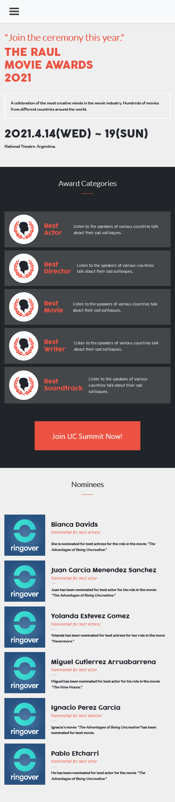

# Project Name

> Template repository with linter setup for HTML/CSS.

# Screenshot goes here

Additional description about the project and its features.

## Built With

- Major languages
- Frameworks
- Technologies used

## Live Demo

[Live Demo Link](https://mistermaxis.github.io/capstone-module-1/)

## Getting Started

To get a local copy up and running follow these simple example steps.

### Prerequisites

### Setup

#### Install webhint:
`npm install --save-dev hint@6.0.x`
#### Run webhint:
`npx hint .`
#### Install styleint:
`npm install --save-dev stylelint@13.3.x stylelint-scss@3.17.x stylelint-config-standard@20.0.x stylelint-csstree-validator`
#### Run styleint (with pure css):
`npx stylelint "**/*.{css,scss}"`

## Authors

👤 **Author1**

- GitHub: [@githubhandle](https://github.com/githubhandle)
- Twitter: [@twitterhandle](https://twitter.com/twitterhandle)
- LinkedIn: [LinkedIn](https://linkedin.com/linkedinhandle)

👤 **Author2**

- GitHub: [@githubhandle](https://github.com/githubhandle)
- Twitter: [@twitterhandle](https://twitter.com/twitterhandle)
- LinkedIn: [LinkedIn](https://linkedin.com/linkedinhandle)

## 🤝 Contributing

Contributions, issues, and feature requests are welcome!

Feel free to check the [issues page](issues/).

## Show your support

Give a ⭐️ if you like this project!

## Acknowledgments

- Hat tip to anyone whose code was used
- Inspiration
- etc

## 📝 License

This project is [MIT](lic.url) licensed.
